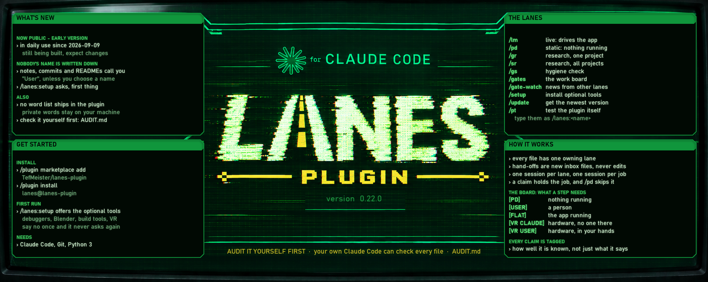

# lanes-plugin



**Run several Claude Code sessions at once without them treading on each other.**

This repository is a Claude Code **plugin marketplace** holding one plugin, `lanes`. Add it with:

```
/plugin marketplace add TefMeister/lanes-plugin
/plugin install lanes@lanes-plugin
```

## 🚧 Early version, still being built

It has been in daily use since 2026-09-09, on two machines, through twenty-odd versions, and it is
made public now so others can use it and find what breaks. It is one person's working tool and it
shows: it was built for flat-to-VR game modding, so many examples and optional tools lean that way.
Expect changes. `/lanes:update` tells you when a new version is out and what changed, and never
installs anything without asking. How well each part is proven, with numbers, is in
[`plugins/lanes/README.md`](plugins/lanes/README.md).

## 🔒 Nobody's name is written down

In everything a session saves or publishes (notes, boards, commit messages, READMEs), the person at
the machine is **"User"**. Your real name, login, e-mail, machine names and home-folder paths are
never written. If you would rather be called something else, `/lanes:setup` asks first thing, and
that one name is then used everywhere.

## 🔍 Check it yourself before you install

**Don't take our word that this is safe.** Ask your own Claude Code to audit every file and link
first. [`AUDIT.md`](AUDIT.md) has a request you can copy and paste. We can't do that check for you;
it only counts when someone else's Claude does it.

## Plugins

| Plugin | What it does | State |
| --- | --- | --- |
| [`lanes`](plugins/lanes/) | Run several Claude Code sessions at once without them treading on each other. | `0.22.0`, early public release |

## Modding games?

The author's games in progress, and the shared research library behind them, are indexed on the
author's [GitHub profile](https://github.com/TefMeister). The plugin itself stays neutral; that pointer
lives here.

## Licence

MIT, see [LICENSE](LICENSE).

*Made for Claude Code; not made by, or affiliated with, Anthropic.*
