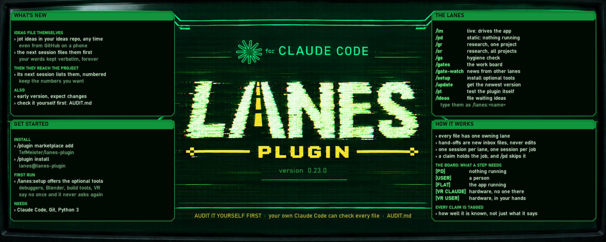

# lanes



**A Claude Code plugin for running several Claude sessions at once, across your projects, without
them undoing each other's work.**

## What it is

**The problem.** Two Claude sessions working on one set of files quietly overwrite each other.
Nothing crashes. The work just disappears.

**The fix.** Every session works in a **lane**, and each lane owns its own files. When one lane has
something for another, it leaves a new file in that lane's inbox instead of editing its files. New
files never clash, so git can always merge them.

**A shared board.** One list of every job, each tagged with what it needs. It answers the question
you have at the start of every session: *what can I actually do right now?*

## The lanes

| Command | Name | What it does |
| --- | --- | --- |
| `/lm` | Live Modding | Claude runs the app itself: starts it, uses it, closes it, and tests its own changes. |
| `/pd` | Parallel Development | Picks the next job that needs nothing running, so it can work beside anything else. |
| `/ms` | Manual Session | You do the hands-on work; Claude gives you the steps and writes the code. |
| `/gr` | Guided Research | Web research for each project, kept in that project's notes. |
| `/sr` | Sweep Research | Research across all projects, kept in one shared library. |
| `/gs` | Good-standing Sweep | Hygiene check: are notes tagged, and are hand-offs being picked up? |
| `/gates` | Gate Board | Shows the work board. |
| `/gate-watch` | Gate Watch | Tells you when another session finishes something. |
| `/ideas` | Ideas | Files the ideas you jotted down, onto the right project. |
| `/menu` | Menu-o-matiC, Move-o-matiC and State-o-matiC | You play a game's menus and a short route once while it records; after that it repeats them by itself, and can tell menu, loading, cutscene and gameplay apart. |
| `/setup` | Setup | First-run setup: your name, this PC's name, and optional tools. |
| `/update` | Update | Gets the newest version of the plugin, after asking you. |
| `/theme` | Theme | The plugin's look (see below): puts it on, or puts your terminal back the way it was. |
| `/pt` | Plugin Test | Tests the plugin itself. |

Type them as `/lanes:<name>`, for example `/lanes:pd`.

**Prefer other names?** Just ask Claude Code, for example: *"make /research run /lanes:gr"*. Any
command can be given a name you like, except `/pd` and `/lm`: their safety checks look for those
two names, so keep them as they are.

## How it works

- **One session per lane, one session per job.** A session claims its job, and the others skip it.
- **`/lm` and `/pd` never work on the same project at once.** While `/lm` holds a project, `/pd` is
  stopped from starting on it and picks another. Two sessions on one project was tried and worked
  once in fifty runs, so it was removed. Instead, `/lm` runs its own helper in the background for
  the no-app-needed work on that project.
- **The board says what each step needs:**

  | Tag | Needs |
  | --- | --- |
  | `[PD]` | nothing running |
  | `[USER]` | a person |
  | `[FLAT]` | the app running |
  | `[VR CLAUDE]` | special hardware plugged in, nobody needed |
  | `[VR USER]` | a person using the special hardware |

- **Every finding says how well it is known,** not just what it says.
- **It tells you which model a job needs.** Before starting, a session says whether the job wants
  the strongest model, the standard one or a light one, and whether the one running fits. Too weak:
  it stops and waits for you to switch. Stronger than needed: it says so and carries on. It also
  names the model for the next step, so you can switch before it starts. Getting it working comes
  first; saving tokens second.
- **Two PCs?** A job only one PC can do is queued for that PC, and greets it at its next session.
- **Nobody's name is written down.** You are "User" unless you choose a name. Each PC is PC1, PC2
  and so on unless you name it. Your real name, login and computer name are never written.
- **Ideas get filed for you.** Jot them into your ideas repo, even from a phone. The next session
  files them, and each project's next session lists them for you to pick from.

## Get started

```
/plugin marketplace add TefMeister/lanes-plugin
/plugin install lanes@lanes-plugin
```

Then run `/lanes:setup`. It asks what to call you and this PC, then offers the optional tools:
debuggers, Blender, build tools, VR. Say no once and it never asks again.

**The Inspector (optional, new in 0.37.0).** Switch it on and every piece of code Claude writes is
looked over: anything messy is noted for a decision before it is uploaded. It never edits code.
Setup asks; it stays off otherwise.

**The look (new in 0.41.0).** This is how the plugin ships: after you install it and restart Claude
Code, the first session puts an old green monitor on your terminal, with the Lanes banner in dim green behind
the text and a light that slowly runs down the screen.


The plugin comes with this one look. If Claude Code is running inside Windows Terminal, it goes on
the tab you are in. If not, it is added as a new tab type called **Green Monitor Claude**: open
Windows Terminal, click the small down arrow next to the + on the tab bar, and pick it. That tab
starts Claude Code on your Desktop. It backs the terminal's settings up first, and leaves a profile
alone if you already gave it a look of your own. Once the look is on, the next session offers (once) a shortcut named **Lanes** on your
Desktop that opens Claude Code in exactly this look; `/lanes:theme shortcut` makes one any time. `/lanes:theme restore` puts
everything back; `theme = off` in `lanes.conf` stops it. It needs Windows Terminal. The style, its
tuning numbers and more styles live in [terminal-themes](https://github.com/TefMeister/terminal-themes).

**Needs:** Claude Code, Git, Python 3.

**Check it first.** Don't take our word that it is safe. [`AUDIT.md`](AUDIT.md) is a request you
paste into your own Claude Code, which then reviews every file before you install.

## Early version

The way of working behind it has been in development since early August 2026. It became this
plugin on 2026-09-09, and has been in daily use on two PCs since then. It was built for turning flat games into VR, so many
examples and optional tools lean that way. The lanes themselves work for any project. Expect changes: `/lanes:update` tells you
what is new and never installs without asking. The full manual is in
[`plugins/lanes/README.md`](plugins/lanes/README.md).

| Plugin | What it does | State |
| --- | --- | --- |
| [`lanes`](plugins/lanes/) | Several Claude Code sessions at once, without them treading on each other. | `0.56.0`, early public release |

## Modding games?

The author's games in progress, and the research behind them, are listed on the author's
[GitHub profile](https://github.com/TefMeister).

## Licence

MIT, see [LICENSE](LICENSE).

*Made for Claude Code; not made by, or affiliated with, Anthropic.*
